<div align="center">

# 🛡️ Fraud-Spike Sentinel

**Track 02 — AI Risk Manager · Razorpay AI Buildathon**

Explainable · Bounded · Gated · Audit-Logged


</div>

An explainable, bounded, and gated fraud-spike detector for Razorpay merchants.
It scores 15-minute transaction windows for four fraud/abuse patterns, **never
auto-blocks a payment**, and reports honest held-out precision/recall — not a
single cherry-picked catch.

<p align="center">
  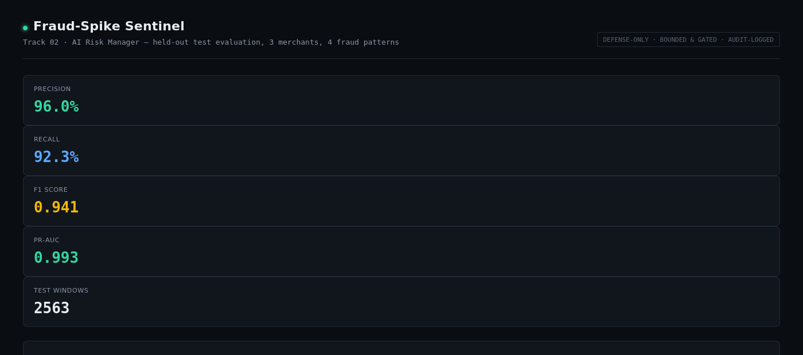
</p>

<details>
<summary><strong>📸 More screenshots (click to expand)</strong></summary>
<br>

**Live demo — click a scenario, get a scored, explained decision.** The chat
box at the bottom (highlighted below) lets a reviewer ask a free-form
follow-up about *why* the window was flagged — answered by the LLM,
grounded only in that window's own stats.

<p align="center">
  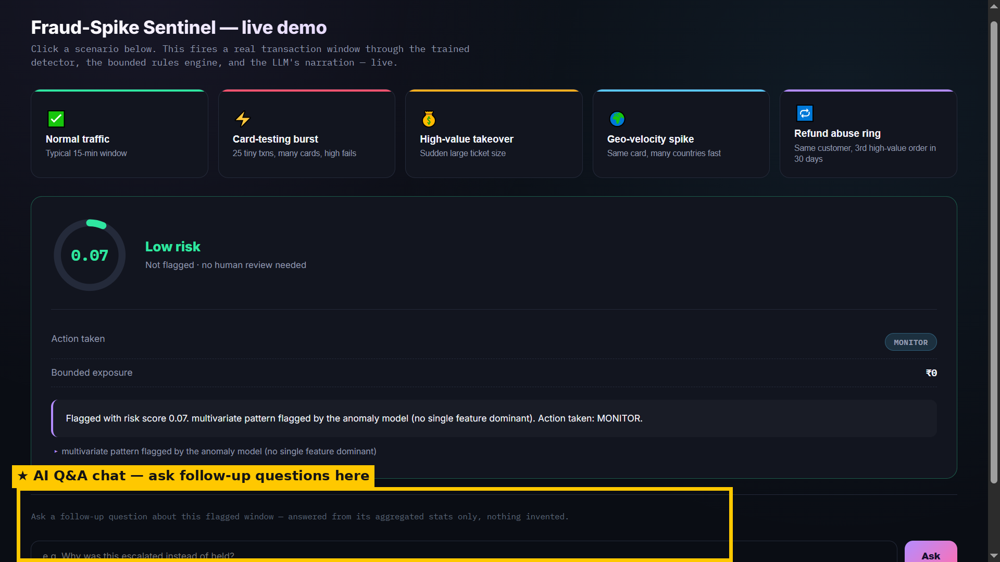
</p>

| Card-testing burst → escalate | High-value takeover → escalate |
|---|---|
| 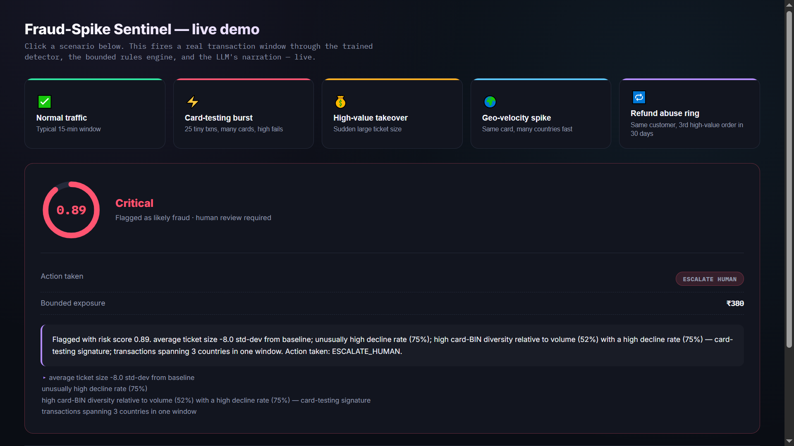 | 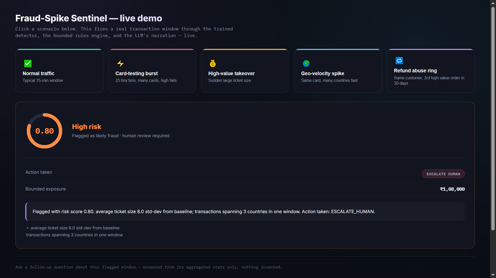 |

| Geo-velocity spike → soft hold | Refund abuse ring → soft hold |
|---|---|
| 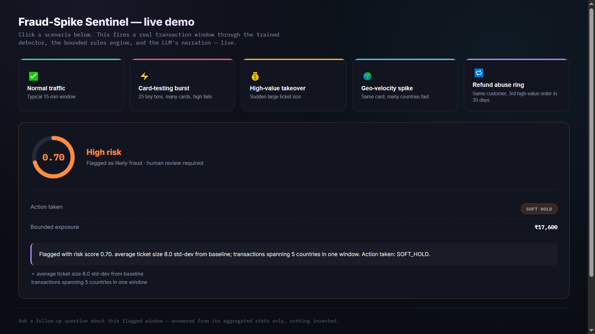 | 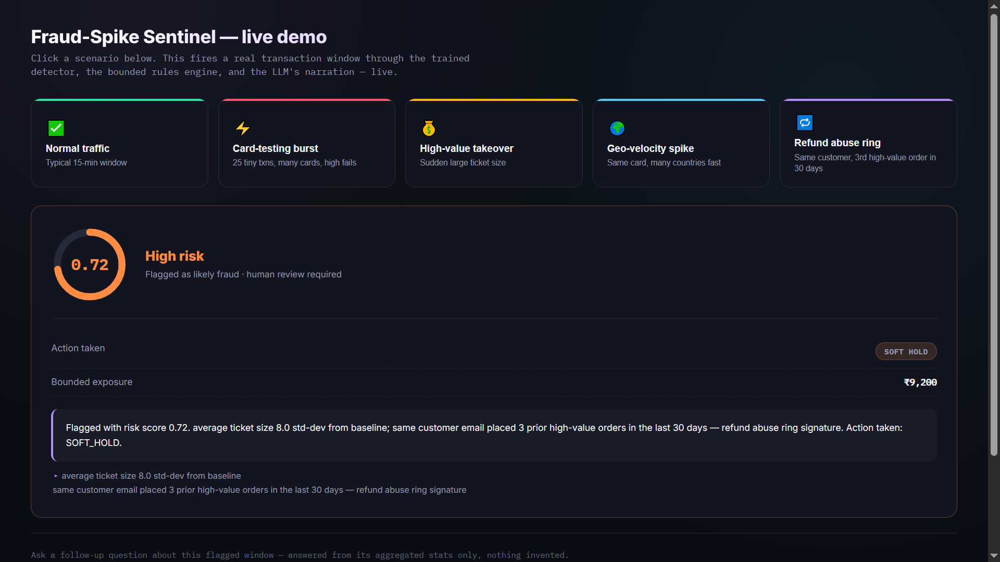 |

| Webhook verification test | Business impact panel |
|---|---|
| 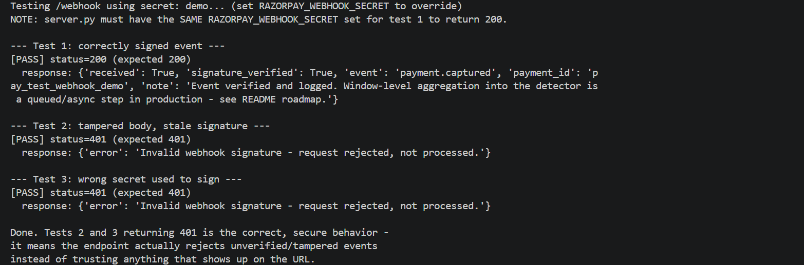 | 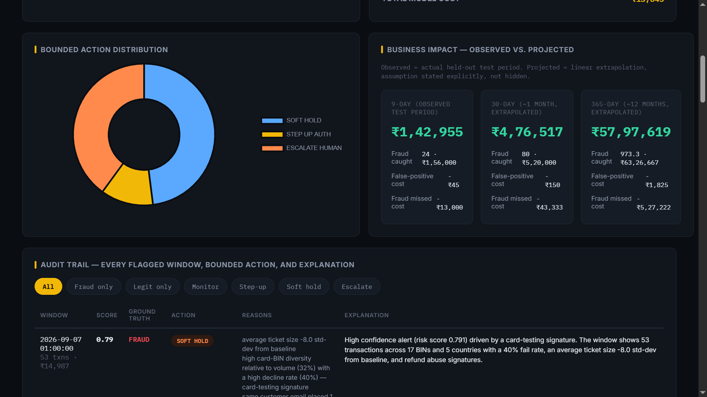 |

*(The webhook test screenshot is still a placeholder — see [Contributing screenshots](#contributing-screenshots) to fill it in. Browser-rendered screenshots show the live Chart.js precision/recall curve and fonts that a headless static render can't capture.)*

| Precision/recall curve & confusion matrix | Audit trail — filterable by action |
|---|---|
| 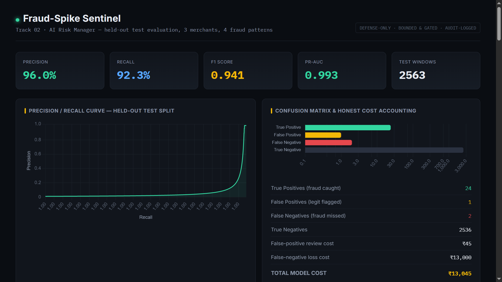 | 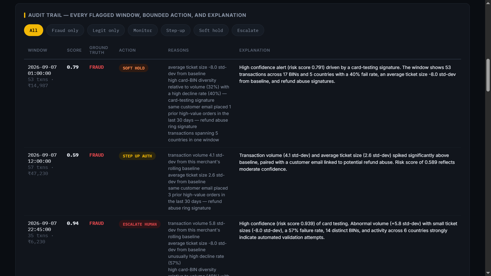 |

| Audit trail — step-up auth | Audit trail — escalate human |
|---|---|
| 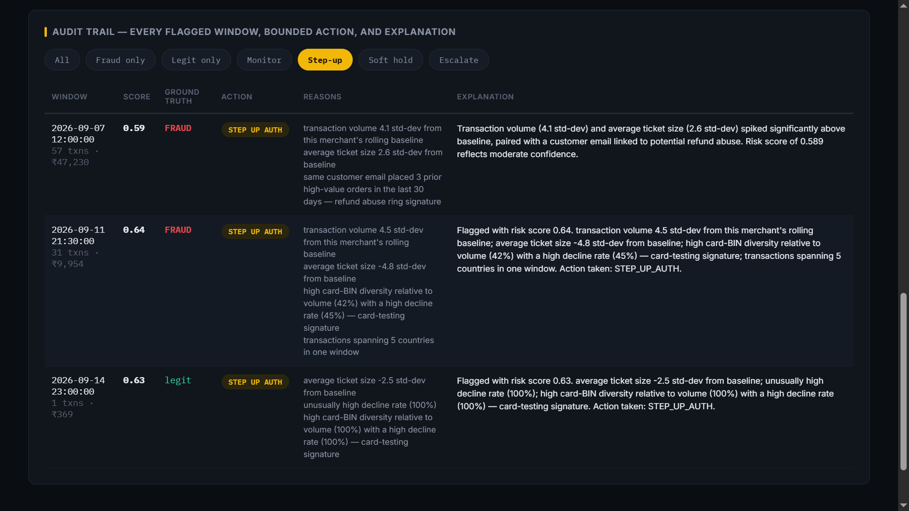 | 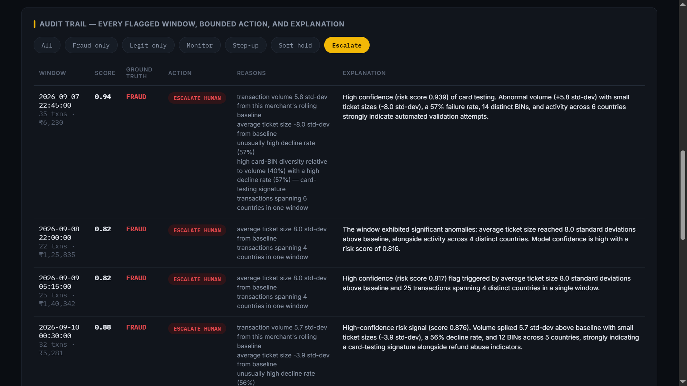 |

</details>

---

## Table of contents

- [The problem](#the-problem)
- [What this builds](#what-this-builds)
- [Architecture](#architecture)
- [Quickstart](#quickstart)
- [Live demo](#live-demo)
- [Results](#results)
- [Business impact](#business-impact)
- [Real Razorpay integration](#real-razorpay-integration)
- [Webhook security](#webhook-security)
- [Why this meets the track's bar](#why-this-meets-the-tracks-bar)
- [Project structure](#project-structure)
- [Production roadmap](#production-roadmap)
- [Honest limitations](#honest-limitations)

---

## The problem

A merchant on Razorpay sees thousands of transactions a day. Buried in that
traffic are three or four fraud/abuse patterns that don't look like a single
suspicious transaction — they look like a **pattern across several
transactions**:

| Pattern | Signature |
|---|---|
| **Card-testing burst** | Many tiny transactions, many distinct cards, high decline rate, in a short window |
| **Account/high-value takeover** | A sudden large-ticket transaction far outside the account's normal spend |
| **Geo-velocity spike** | Same card, multiple countries, minutes apart — physically impossible travel |
| **Refund abuse ring** | Same customer email, repeated high-value order → refund cycles over weeks (a slow, behavioral pattern, not a burst) |

Missed fraud is a direct loss. But a detector that's too aggressive is *also*
a loss — every wrongly-flagged genuine customer is lost revenue and a support
ticket. The track's bar is explicit about this: **honest metrics including
false-positive cost**, and **strictly defense-only** — nothing here is allowed
to autonomously block a real payment.

## What this builds

A full pipeline: **synthetic-but-schema-real transaction data → feature
engineering → an ensemble detector → a bounded rules engine → LLM-narrated,
audited decisions → a live-scoring API → a dashboard.** Every stage is
designed around one constraint: nothing acts on money without being
explainable, bounded, and logged.

## Architecture

```
Transactions (Razorpay payment.entity shape)
        │
        ▼
15-min window aggregation  (detector/features.py)
   rolling z-scores · card-BIN diversity · fail rate · repeat-customer count
        │
        ▼
Ensemble detector          (detector/model.py)
   transparent z-score rule  +  Isolation Forest (multivariate)
        │
        ▼
Bounded rules engine        (detector/rules_engine.py)
   MONITOR → STEP_UP_AUTH → SOFT_HOLD → ESCALATE_HUMAN
   hard ₹ ceiling — never an autonomous block
        │
        ├──► LLM narration (Claude or Gemini)   → plain-English "why"
        └──► Audit trail (JSONL)                → every decision logged
        │
        ▼
Dashboard (batch) · Live API (server.py) · Q&A chat · Webhook receiver
```

Two entry points share this exact pipeline:
- **`main.py`** — batch run over the full held-out test set → `outputs/dashboard.html`
- **`server.py`** — the same trained model behind a live FastAPI service, one transaction at a time

## Quickstart

```bash
pip install -r requirements.txt
python3 main.py
```

Open `outputs/dashboard.html` in a browser. That's the whole batch pipeline —
metrics, cost accounting, business impact, and a full audit trail of every
flagged window.

**LLM narration is optional.** Set `ANTHROPIC_API_KEY` (Claude) or
`GEMINI_API_KEY` (Gemini, free tier) to get live natural-language
explanations; without either, the pipeline still runs end-to-end using
offline template explanations — this is intentional, not a degraded mode
(see [Honest limitations](#honest-limitations)). If both keys are set,
Claude is used.

## Live demo

```bash
pip install fastapi uvicorn
python3 server.py
```

Open **`http://localhost:8000/demo`**. Five buttons fire real transaction
windows through the live-trained detector:

| Scenario | What it tests |
|---|---|
| Normal traffic | Should score low, no action |
| Card-testing burst | High decline rate + many cards → escalate |
| High-value takeover | Large ticket, new geography → escalate |
| Geo-velocity spike | Same card, many countries fast → hold |
| Refund abuse ring | Same email, 3rd high-value order in 30 days → hold |

After scoring, a **chat panel** lets you ask a free-form follow-up question
("why was this escalated instead of held?") — answered by the LLM, grounded
only in that window's own stats, never inventing a card number or name it
wasn't given.

Other live endpoints: `POST /feedback` (bounded adaptive threshold — see
below), `GET /threshold_status`, `GET /audit`, `POST /webhook` (see
[Webhook security](#webhook-security)).

### Adaptive threshold

The score threshold isn't frozen after training. `POST /feedback` lets a
human reviewer confirm or reject a flagged window; five consecutive
false-positive reviews nudge the threshold up, missed fraud nudges it down —
but it can **never drift more than ±0.15** from the original validation-set
value, and every adjustment is logged with its reason
(`detector/adaptive_threshold.py`, `outputs/threshold_adjustments.jsonl`).
This keeps the system adaptive without becoming an unbounded feedback loop.

## Results

Held-out test split — 2,563 windows across 3 merchants with genuinely
different baseline traffic (a low-volume merchant, a mid-size retailer, a
high-volume merchant), never seen during training or threshold selection:

| Metric | Value |
|---|---|
| Precision | 96.0% |
| Recall | 92.3% |
| F1 | 0.941 |
| PR-AUC | 0.993 |
| True positives / False positives / False negatives | 24 / 1 / 2 |
| False-positive review cost | ₹45 |
| False-negative (missed fraud) cost | ₹13,000 |

Numbers regenerate on every `main.py` run — nothing here is hardcoded or
cherry-picked from a single lucky seed.

## Business impact

`business_impact.py` (also rendered on the dashboard) converts those metrics
into ₹ language:

| Period | Net impact |
|---|---|
| Observed (9-day test period) | ₹1,42,955 |
| Projected — 30 days | ₹4,76,517 |
| Projected — 365 days | ₹57,97,619 |

The 30/365-day figures are **explicitly labeled as linear extrapolations** of
the observed rate — the dashboard states that assumption outright rather than
presenting a single impressive number with no context.

## Real Razorpay integration

Every synthetic transaction is shaped **exactly** like Razorpay's real
`payment.entity` object — same field names, paise amounts, real `card_iin`,
real `status`/`error_reason` values pulled from Razorpay's own API docs. This
isn't just schema-matching, either:

- `data/seed_razorpay_testmode.py` creates **real orders** via the live
  Orders API and completes **real test-mode payments** through Razorpay's
  own hosted Checkout (`dashboard/manual_checkout.html`)
- `data/fetch_real_testmode.py` pulls them back via the real Fetch Payments
  API — genuine API responses, saved to `outputs/real_testmode_payments.csv`

**What's real vs. synthetic, stated plainly:** the schema, the API calls, and
the baseline traffic can be 100% real Razorpay output. The fraud *labels* are
necessarily synthetic — a test-mode sandbox has no real fraud to observe —
so the held-out precision/recall evaluation intentionally runs on the
labelled synthetic set, not the real-fetched traffic.

## Webhook security

`POST /webhook` is a real Razorpay webhook receiver with HMAC-SHA256
signature verification implemented from first principles
(`webhooks/signature_verification.py`), not just called via the SDK helper.

This matters specifically for a fraud pipeline: an **unverified** webhook
endpoint is itself an attack surface — anyone who finds the URL could inject
fabricated `payment.captured` events to poison what the detector treats as
normal traffic. Tampered bodies and wrong secrets are rejected with `401`,
never silently processed. Razorpay's webhook signature and its separate
Checkout payment signature (different key, different signed payload — a
common source of bugs) are both implemented and clearly distinguished in
code comments.

```bash
python3 webhooks/test_webhook.py   # against a running server.py
```
sends a correctly-signed event (accepted), a tampered one (rejected), and
one signed with the wrong secret (rejected) — live, not asserted in a unit
test in isolation.

## Why this meets the track's bar

| Track requirement | How it's met |
|---|---|
| Honest metrics incl. false-positive cost | Time-based held-out split, per-merchant, cost priced in ₹ |
| Strictly defense-only | No autonomous block; hard-bounded actions; high-exposure cases always escalate to a human |
| Explainable | Deterministic feature-level reasons + LLM narration + interactive Q&A, all logged before anything happens |
| One failure handled gracefully | `main.py` step 6 explicitly simulates an LLM outage and completes anyway |

## Project structure

```
main.py                          batch pipeline entry point → dashboard.html
server.py                        live FastAPI service (/score, /ask, /feedback, /webhook, /demo)
business_impact.py               ₹ business-impact projection

data/
  synthetic_generator.py         multi-pattern fraud + hard-negative synthetic data (real Razorpay schema)
  razorpay_client.py             authenticated Razorpay test-mode API client
  seed_razorpay_testmode.py      creates real test-mode orders + payments
  fetch_real_testmode.py         fetches real payments back via the API

detector/
  features.py                    15-min window aggregation, rolling z-scores, repeat-customer tracking
  model.py                       ensemble detector (z-score rule + Isolation Forest)
  rules_engine.py                bounded/gated action layer + cost accounting
  adaptive_threshold.py          bounded, feedback-driven threshold adjustment

evaluation/metrics.py            threshold selection + held-out evaluation
llm/explainer.py                 Claude/Gemini narration + Q&A, with offline fallback
audit/audit_log.py               append-only JSONL audit trail
webhooks/
  signature_verification.py      HMAC-SHA256 webhook + payment signature verification
  test_webhook.py                live verification test (valid / tampered / wrong-secret)
dashboard/
  template.html, build_dashboard.py    batch dashboard
  live_demo.html                       click-to-fire live demo UI
  manual_checkout.html                 real Razorpay Checkout widget for seeding test payments
```

## Production roadmap

If this moved from hackathon scope to an actual Risk team backlog, in order:

1. **Async webhook → window aggregation.** `/webhook` verifies and logs
   events correctly today; the next step is a queue (SQS/Redis stream) that
   buffers verified events into 15-min per-merchant windows before they hit
   the detector, so live traffic gets the same scoring path as the batch
   pipeline instead of staying event-level.
2. **Seasonal-aware business impact.** Replace the linear extrapolation in
   `business_impact.py` with a model that accounts for known high-fraud
   periods (festival sales, month-end), using real historical loss data
   once available instead of the fixed `AVG_FRAUD_LOSS_INR` constant.
3. **Per-merchant threshold calibration.** `detector/adaptive_threshold.py`
   currently bounds one threshold; a production version would maintain a
   bounded threshold *per merchant*, since a low-volume and high-volume
   merchant's healthy false-positive rate isn't the same number.
4. **Replace Isolation Forest with a supervised model once labeled
   incident data exists.** The unsupervised ensemble here is the right
   choice with zero real fraud labels; real chargeback/dispute outcomes
   would let a supervised model (e.g. gradient boosting) outperform it while
   keeping the same rules-engine/audit-trail architecture unchanged.

## Honest limitations

Stated explicitly rather than glossed over:

- **Fraud labels are synthetic.** Razorpay's sandbox has no real fraud to
  learn from, so ground-truth labels are injected based on documented fraud
  typologies (Ravelin's 2025 Fraud Trends Report, Razorpay's own chargebacks
  blog), not observed from real incidents.
- **Business-impact projections are linear extrapolations** of a 9-day
  observed window — real fraud is seasonal (e.g. spikes around sales
  events), which the current projection doesn't model.
- **Webhook events aren't yet aggregated into windows.** `/webhook` verifies
  and logs individual events correctly; feeding a live event stream into the
  window-level detector would need an async buffering step this hackathon
  scope didn't include — stated here rather than faked with a fabricated
  instant per-event score.
- **Single-merchant live demo.** `server.py` trains on all 3 merchants but
  demos against one (`acc_merchant001`) for simplicity; the batch pipeline
  (`main.py`) is what's validated across all three.

